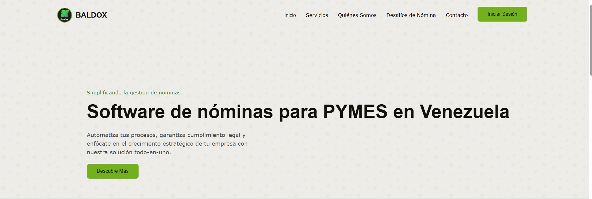

# Landing Page - Proyecto INGENIERÍA DEL SOFTWARE

Este proyecto es una landing page desarrollada como parte de la materia Ingeniería del Software. Incluye páginas de inicio, login y registro, utilizando Tailwind CSS para los estilos y una estructura modular para facilitar el mantenimiento.

## Imagen del proyecto


## Estructura del proyecto

```
LANDING/
├── css/
│   ├── style.css
│   └── tailwind.css
├── img/
│   └── BALDOX LOGO.jpg
│   └── LANDING.png
├── js/
│   ├── app.js
│   └── login.js
├── index.html
├── login.html
├── register.html
```

## Descripción de archivos
- `index.html`: Página principal de la landing.
- `login.html`: Página de inicio de sesión.
- `register.html`: Página de registro de usuario.
- `css/style.css`: Estilos personalizados.
- `css/tailwind.css`: Estilos generados por Tailwind CSS.
- `img/BALDOX LOGO.jpg`: Logo utilizado en la landing.
- `js/app.js`: Lógica general de la landing.
- `js/login.js`: Lógica específica para el login.

## Instalación y uso
1. Clona el repositorio:
   ```bash
   git clone https://github.com/VictorContr/Landing-Page-ING.git
   ```
2. Abre la carpeta `LANDING` en tu editor de preferencia.
3. Abre `index.html` en tu navegador para ver la landing page.

## Créditos
- Autor1: Victor Contreras
- Autor2: Guillermo Alvarez
- Materia: Ingeniería del Software

---
¡Personaliza este README según avances en el proyecto!
